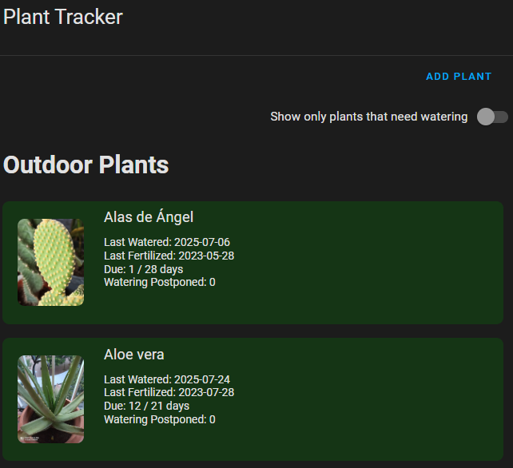
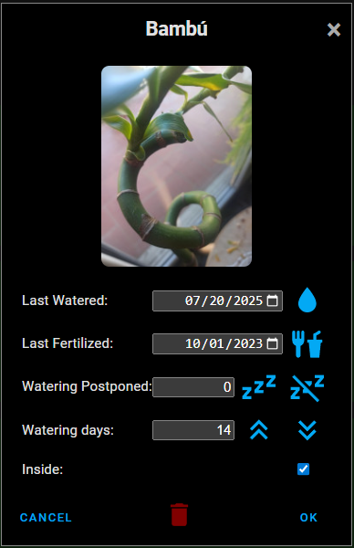

# 🌿 Plant Tracker for Home Assistant

**Plant Tracker** is a custom integration and Lovelace card for [Home Assistant](https://www.home-assistant.io/) that helps you manage and monitor your houseplants. Track when each plant was last watered or fertilized, define care intervals, and visualize everything with a custom card.

This work has been inspired by [Plant tracker for Home Assistant](https://github.com/mountwebs/ha-plant-tracker).


## Features

- Track multiple plants with individual settings
- Display days since last watering or fertilizing
- Custom watering intervals and postponements
- Indoor/outdoor plants
- Configurable plant image
- Built-in services to create, update, and delete plants
- Automatic daily updates
- Logbook integration for activity tracking
- Companion Lovelace card


# 🌱 Plant Tracker Component

## Installation

### Manual Installation

1. Clone or download this repository.
2. Copy the `plant_tracker` folder to your Home Assistant `custom_components/` directory:
3. Restart Home Assistant.
4. Go to **Settings > Devices & Services > Add Integration**.
5. Search for **Plant Tracker** and add it.

## Plant Data Fields

| Field                 | Description                                               |
|-----------------------|-----------------------------------------------------------|
| `plant_name`          | Name of the plant                                         |
| `last_watered`        | Last watered date (e.g., `2025-07-30`)                    |
| `last_fertilized`     | Last fertilized date (optional)                           |
| `watering_interval`   | Days between waterings (default: `14`)                    |
| `watering_postponed`  | Extra days to postpone watering (default: `0`)            |
| `inside`              | Whether the plant is indoors (`true` or `false`)          |
| `image`               | Custom image path or entity picture (optional)            |

## Logbook Integration

Plant Tracker logs important events to the Home Assistant logbook. These entries help you keep track of changes made either manually or via automation.
- `Monstera was created.`
- `Monstera was updated.`
- `Monstera was deleted.`

These messages appear in Home Assistant’s **Logbook** panel.


# 🖥️ Lovelace Card

Visualize your plants and their watering status using a custom Lovelace card.

## Features

- Displays each plant with its current watering status
- Shows days since last watering and fertilizing
- Customizable images for each plant
- Quick access to edit plant details via popup

## Preview

### Plant Tracker Card



*Overview of multiple plants and their watering status.*

### Edit Plant Popup



*Popup dialog for editing plant details such as watering schedule and last watered date.*


## Installation

1. Download the `plant-tracker-card.js` file and place it in your `config/www/` directory: config/www/plant-tracker-card.js
2. Add the resource to your dashboard via **Settings > Dashboards > Resources**:

```yaml
URL: /local/plant-tracker-card.js
```

## Example Card Configuration

```yaml
type: custom:plant-tracker-card
```

## Adding Plant Images

You can add custom images for your plants to enhance the Lovelace card and UI experience.

1. Place your plant images in your Home Assistant `config/www/plant_tracker/` directory.
   - The image filename **must** match the plant's name, e.g., `Monstera.jpg` for a plant named "Monstera".
   - Example path:
     ```
     config/www/plant_tracker/Monstera.jpg
     ```
The Lovelace card and UI will use this image for the corresponding plant.

# 🐛 Issues & Feedback

If you encounter any issues or would like to suggest improvements:

- 📌 Open an issue on GitHub: [https://github.com/xplanes/ha-plant-tracker/issues](https://github.com/xplanes/ha-plant-tracker/issues)
- 🙌 Pull requests are welcome!

Please include logs or reproduction steps when reporting bugs.


# 🧠 Roadmap

Planned features and improvements for future versions:

- ✅ Create, update, and delete plant entries
- ✅ Daily tracking of days since watering
- ✅ Lovelace card for visualizing plant data
- ✅ Logbook integration
- 🔜 Reminder notifications for watering and fertilizing
- 🔜 Integration with moisture/humidity sensors
- 🔜 Multi-language support

Feel free to contribute to the roadmap or suggest new ideas!


## 📄 License

This project is licensed under the **MIT License**.
See the [LICENSE](LICENSE) file for full license text.


© 2025 [@xplanes](https://github.com/xplanes)
